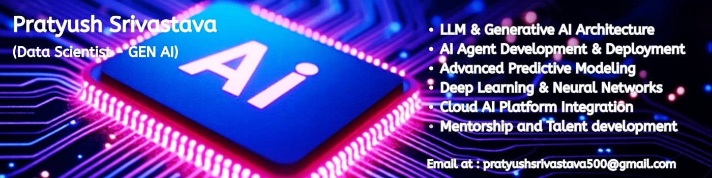

<h1 align="center">Hi 👋, I'm Pratyush Srivastava</h1>
<h3 align="center">🚀 Data Scientist | AI/ML Engineer | NLP & Generative AI Enthusiast</h3>

---

### 🧠 About Me  
- 🎓 **M.Tech in Artificial Intelligence & Machine Learning** | **B.Tech in Computer Science** – *Galgotias University*  
- 💼 **Data Scientist & AI Engineer** with **3.5+ years** of experience in:
  - **Machine Learning, Deep Learning, NLP, and Generative AI**
  - **LLMs, RAG (Retrieval-Augmented Generation), and AI Agents**
- 🧩 Trained and mentored **2000+ students**, delivering **1000+ live sessions** on Python, ML & AI  
- ☁️ Skilled in **Vertex AI, AWS Bedrock, SageMaker, LangChain, and CrewAI**  
- 💬 Ask me about **Python, Machine Learning, Deep Learning, NLP, and Generative AI**  
- ⚡ *Fun fact:* I love transforming data into intelligent systems that solve real-world problems!  

---

### 💼 Professional Summary  
Results-driven **Data Scientist** with 3+ years of experience in **Machine Learning, Deep Learning, NLP, and Generative AI**.  
Proficient in developing **end-to-end AI-driven solutions**, integrating **LLMs (OpenAI, Vertex AI)**, and building **RAG-based intelligent agents** for dynamic automation.  
Strong expertise in **data preprocessing, model training, and deployment** with **FastAPI, Flask, and Streamlit**.  
Skilled in **LangChain, Hugging Face Transformers, and CrewAI** for advanced **Generative AI pipelines**.  
Experienced in **Google Cloud (Vertex AI, BigQuery)** and **AWS (SageMaker, Bedrock, Lambda)** for scalable deployments.  

---

### 🧠 Technical Skills  

#### 💻 Languages  
Python | C | SQL (MySQL, PostgreSQL) | HTML | CSS | Java | JavaScript  

#### 🧩 ML & DL Frameworks / Libraries  
NumPy | Pandas | Scikit-learn | TensorFlow | Keras | PyTorch | XGBoost | LightGBM | OpenCV | Seaborn | Matplotlib  

#### 🤖 LLM & Generative AI Tools  
LangChain | Hugging Face Transformers | CrewAI | RAG | Prompt Engineering | AI Agents | FAISS | OpenAI API | Gemini | Vertex AI  

#### ☁️ Cloud Platforms & Services  
Google Cloud Platform (Vertex AI, BigQuery, Cloud Storage, Cloud Functions)  
AWS (Bedrock, SageMaker, Lambda, EC2, S3) | Heroku | Firebase  

#### 🧰 Developer Tools & IDEs  
Git | GitHub | VS Code | PyCharm | IntelliJ | Eclipse | Anaconda | Jupyter Notebook | Docker | Linux  

#### 📊 Business & Productivity Tools  
Power BI | Tableau | MS Excel | PowerPoint | MS Word  

#### ⚙️ Core Competencies  
Data Science | Machine Learning | Deep Learning | Generative AI | NLP | AI Agents |  
Statistical Analysis | Predictive Modeling | Business Analytics | Model Deployment |  
Data-Driven Decision Making | Customer Insights | Automation | MLOps  

---

### 🧾 Professional Experience  

**Digital Specialist Engineer (Analytics)** — *Infosys Limited, Chandigarh (July 2022 – Present)*  
- Partnered with cross-functional teams to define AI & analytics project requirements.  
- Designed and optimized **Generative AI models** for improved scalability and performance.  
- Built and maintained **data pipelines** for preprocessing, feature extraction, and model training.  
- Developed AI best practices and optimized deployment processes using **Vertex AI** and **AWS**.  
- Enhanced analytics efficiency with KPI dashboards and actionable business insights.  

---

### 🚀 Professional Projects  

#### 🧩 **LGE US Sales & Site Analytics Assistant** | *Python, NLP, Vertex AI, BigQuery, Gemini LLM*  
- Built an **AI-powered chatbot** for sales analytics using **Vertex AI** and **Gemini LLM**.  
- Engineered **real-time query generation and summarization** pipelines via NLP and SQL.  
- Enhanced user experience with **3s faster query responses** and dynamic visualizations.  

#### 🏠 **Home Seller Assistant** | *Python, LLMs, RAG, LangChain, GCP, FAISS*  
- Developed a **Conversational AI agent** for intelligent mortgage document understanding.  
- Integrated **RAG architecture** for improved retrieval accuracy and contextual awareness.  
- Deployed a **GCP-based scalable pipeline**, reducing manual data entry and errors.  

#### 💉 **Medical Insurance Price Prediction** | *Python, Scikit-learn, Pandas, NumPy, Matplotlib*  
- Built a **regression model** to predict insurance premiums from demographic & health data.  
- Conducted **EDA** and applied **regularization techniques (Ridge, Lasso)** to improve generalization.  

#### 🍄 **Mushroom Classification Web App** | *Python, Scikit-learn, Streamlit, Pandas*  
- Developed a **Streamlit web app** to classify mushrooms (edible vs poisonous).  
- Compared multiple ML models (Logistic Regression, Random Forest, SVM) achieving **high accuracy**.  

---

### 🧪 Research & Publications  
- 📘 *Attendance Management System Using OpenCV* — IEEE ICCCNet 2022 *(Scopus Indexed)*  
- 🍔 *Food Calorie Prediction Using MobileNet* — Presented at ICARI-2022  

---

### 🏆 Certifications & Achievements  
- 🥇 **All India Rank 6**, National Engineering Olympiad 2021 (NEO 4.0)  
- 🏁 **Finalist**, Ami-Techfiesta 2020 Programming Challenge  
- 🎓 **Microsoft Certified**: Azure AI Fundamentals | MTA Python Programming  
- 🧾 **Infosys Certified**: Python Programmer & Python Associate  

---

### 📊 GitHub Analytics  

  
  

  

---

### 🌐 Connect with Me  

---

### ✨ Quote I Live By  
> “Code is not just instructions for a machine — it’s a reflection of how we understand intelligence.”

---

⭐ **If you find my work interesting, consider following me and giving a star!**  
Let’s build intelligent systems together! 🚀
